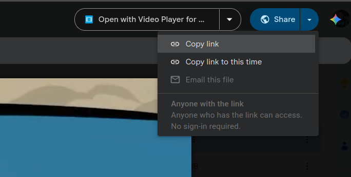

<div align="center">

# DriveStream

**Turn any public Google Drive video into a clean, direct stream URL.**

Plays in VLC, mpv, IINA, and browser `<video>` tags, with instant seeking.

[](https://drivestream-alpha.vercel.app/)
[](LICENSE)


[**Live Demo**](https://drivestream-alpha.vercel.app/) · [Report a Bug](https://github.com/AdnanZamanNiloy/drivestream/issues)

</div>

---

## Features

- **Instant seeking:** `Range` requests are forwarded to Google and the `206 Partial Content` response is passed straight back.
- **Zero buffering:** a streaming proxy that never writes to disk.
- **Plays anywhere:** VLC, mpv, IINA, and HTML5 `<video>`.
- **Flexible input:** accepts any common Drive link format, or a bare file ID.

## Quick Start

**1. Copy your Drive link.** Open the video in Google Drive, click **Share**, make sure access is set to **Anyone with the link**, then click **Copy link**.

<p align="center">
  
</p>

**2. Paste it into [DriveStream](https://drivestream-alpha.vercel.app/)** to get a permanent stream URL, along with the file name, size, and type.

**3. Open the URL in any player.**

```bash
vlc  "https://drivestream-alpha.vercel.app/api/stream/<fileId>"
mpv  "https://drivestream-alpha.vercel.app/api/stream/<fileId>"
```

```html
<video src="https://drivestream-alpha.vercel.app/api/stream/<fileId>" controls></video>
```

Verify range support with:

```bash
curl -I "https://drivestream-alpha.vercel.app/api/stream/<fileId>"   # expect 206 / Accept-Ranges
```

## Supported Inputs

| Input | Example |
| --- | --- |
| File view link | `/file/d/<ID>/view` |
| ID parameter | `?id=<ID>` |
| Direct download | `uc?export=download` |
| Usercontent / Docs links | `drive.usercontent.google.com`, `docs.google.com` |
| Bare file ID | `<ID>` |
| Folders | requires `GOOGLE_API_KEY` |

## How It Works

```
Player ── Range: bytes=0-999 ──▶ DriveStream /api/stream/<fileId>
                                    │  forwards Range, strips expiring
                                    │  Google params (authuser, uuid, at)
                                    ▼
             drive.usercontent.google.com/download?id=<fileId>
                                    │
             206 Partial Content + Content-Range ◀── piped straight through
```

1. **Resolve:** validates the link and probes the file with a 1-byte `Range` request.
2. **Stream:** forwards the client's `Range` header to Google and returns the `206` response untouched.
3. **Thumbnail:** proxies the Drive poster image for previews.

## Self-Hosting

```bash
git clone https://github.com/AdnanZamanNiloy/drivestream.git
cd drivestream
npm install
npm run dev
```

Optional: set `GOOGLE_API_KEY` in `.env.local` to enable folder support.

## Notes

- The file must be shared as **Anyone with the link**.
- DriveStream proxies Drive. It does not bypass permissions or quotas.

## Tech Stack

Next.js 16 (App Router) · TypeScript · React 19 · Tailwind CSS 4 · shadcn/ui, using native `fetch` streaming with no extra media server.

## License

[MIT](LICENSE) © Adnan Zaman
